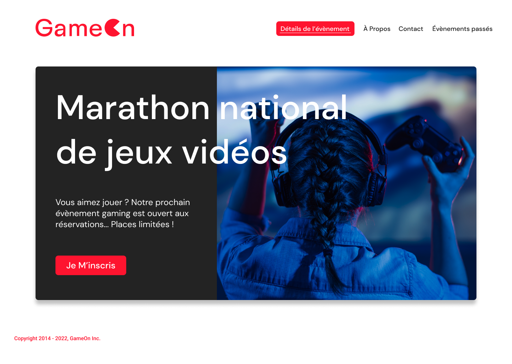

# GameOn - Marathon national de jeux vidéos

> OpenClassrooms - "Développeur d'application - JavaScript React".  
> Créez une landing page avec Javascript.  
\
> Link : [GameOn website](https://yann-github.github.io/GameOn-website-FR/starterOnly/)  
\

  
\

## Objectifs

1. [Forkez ce repo](https://github.com/OpenClassrooms-Student-Center/GameOn-website-FR/) ;
2. Il est conseillé d'utiliser VisualStudio Code et vous pouvez utiliser Docker, mais ce n'est pas obligatoire ;
3. Il n'y a aucune dépendance ;
4. Vous ne devez utiliser que du CSS personnalisé et du JavaScript pur, sans jQuery, Bootstrap ou autre librairie.

## Compétences évaluées

- Utiliser un système de gestion de versions pour le suivi du projet
- Corriger les issues signalées sur le dépôt Github
- Utiliser JavaScript pour la navigation et pour la validation du formulaire
- Utiliser les Regex pour la validation des inputs
